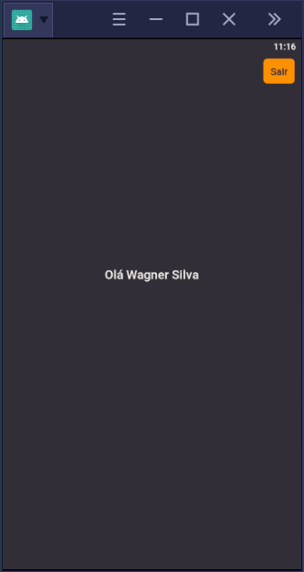

<h3 align="center">
  GoBarber Web
</h3>

<p align="center">
  <a href="#rocket-o-projeto">O projeto</a>&nbsp;&nbsp;&nbsp;|&nbsp;&nbsp;&nbsp;
  <a href="#hammer-testes">Testes</a>&nbsp;&nbsp;&nbsp;|&nbsp;&nbsp;&nbsp;
  <a href="#snowflake-instalation">Template</a>&nbsp;&nbsp;&nbsp;|&nbsp;&nbsp;&nbsp;
  <a href="#gear-tecnologias-e-ferramentas">Tecnologias e ferramentas</a>&nbsp;&nbsp;&nbsp;|&nbsp;&nbsp;&nbsp;
  <a href="#memo-licença">Licença</a>
</p>

## :rocket: O projeto
Projeto mobile da aplicação GoBarber desenvolvido em aula no curso Bootcamp - Rocketseat

## :hammer: Testes

Aqui esta uma print dos testes realizados utilizando o BlueStacks4.

<div>



</div>


## :snowflake: Instalation

Para instalação, clone o projeto e execute o comando:

```
yarn
```

## :gear: Tecnologias e ferramentas

Foram utilizadas as tecnologias e ferramentas:
* [React](https://pt-br.reactjs.org/)
* [NodeJs](https://nodejs.org/)
* [Axios](https://www.npmjs.com/package/axios)
* [Typescript](https://www.typescriptlang.org/)
* [TypeORM](https://typeorm.io/#/)
* [Docker](https://www.docker.com/)
* [Postgres](https://www.postgresql.org/)


## :memo: Licença

Esse projeto está sob a licença MIT. Veja o arquivo [LICENSE](LICENSE.md) para mais detalhes.

